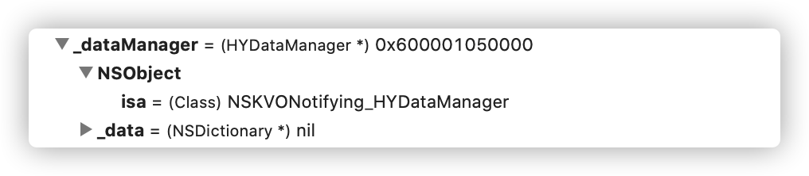

### KVO实现原理
官方文档描述：  
Automatic key-value observing is implemented using a technique called isa-swizzling.

The isa pointer, as the name suggests, points to the object's class which maintains a dispatch table. This dispatch table essentially contains pointers to the methods the class implements, among other data.

When an observer is registered for an attribute of an object the isa pointer of the observed object is modified, pointing to an intermediate class rather than at the true class. As a result the value of the isa pointer does not necessarily reflect the actual class of the instance.

You should never rely on the isa pointer to determine class membership. Instead, you should use the class method to determine the class of an object instance.

简单来说就是苹果利用isa-swizzling技术，当我们给一个对象添加一个观察者时，首先创建一个新类继承自原来的类，重写相关set方法，在值变更前后通知观察者值有变更，然后将对象的isa指针指向新创建的类，当调用对象方法时就会从新类的方法列表里面找，从而在调用set方法修改值就会通知到观察者。

### 实践
新建HYDataManager类  
当为该类实例添加Observer后，HYDataManager类的对象的isa指针会指向一个新的类NSKVONotifying_HYDataManager。


KVO发送改变通知主要通过NSObject的下面两个方法实现：
- (void)willChangeValueForKey:(NSString *)key;//改变前通知
- (void)didChangeValueForKey:(NSString *)key;//改变后通知

NSKVONotifying_HYDataManager重写setData:方法实现类似如下所示：
```Objective-C
- (void)setData:(NSDictionary *)data {
    [self willChangeValueForKey:@"data"];
    [super setData:data];
    [self didChangevlueForKey:@"data"];
}
```

KVO接收改变通知需要实现下面方法：
```Objective-C
- (void)observeValueForKeyPath:(nullable NSString *)keyPath ofObject:(nullable id)object change:(nullable NSDictionary<NSKeyValueChangeKey, id> *)change context:(nullable void *)context;
```

