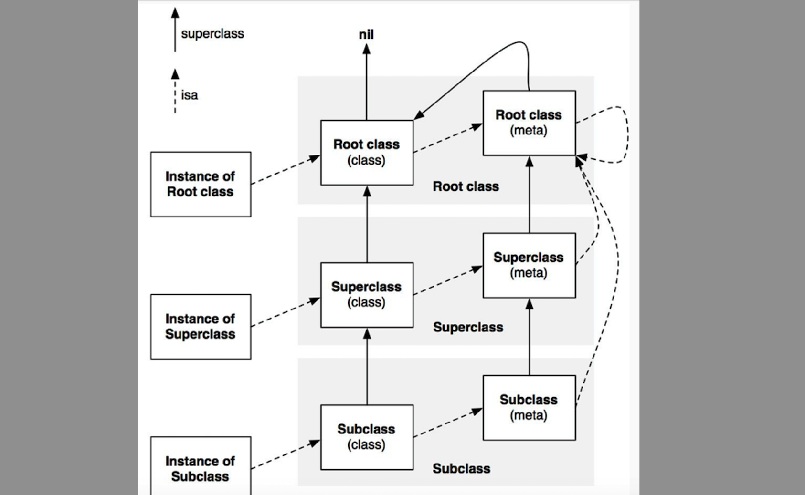

### 方法查找过程
先看下图了解下OC一切皆对象思想的设计

每一个对象内部都有一个**isa**指针，指向他的类对象，类对象中存放着本对象的对象方法列表。  
其中类对象的**isa**指针也指向一个类对象，也称为原类对象，原类对象存放的是类对象的方法列表，即类方法。  
每个类对象内部还有一个**superclass**指针指向它的父类对象。

所以方法查找过程(不考虑缓存)为：  
根据对象的**isa**指针找到类对象->遍历对象的方法列表匹配->没有匹配往上遍历父类中的方法列表匹配->直到RootClass都没有匹配则进入下面的消息转发机制

### 消息转发机制
过程如下

**第一步**：调用下面两个方法来尝试解决
```Objective-C
+ (BOOL)resolveClassMethod:(SEL)sel;
+ (BOOL)resolveInstanceMethod:(SEL)sel;
```
如果是类方法调第一个，实例方法调第二个。  
如果返回NO，说明没有解决接着进入第二步

**第二步**:
```Objective-C
- (id)forwardingTargetForSelector:(SEL)aSelector;
```
尝试找到一个可以接收消息的对象，如果返回nil则进入第三步

**第三步**:
```Objective-C
先通过调用下面方法生成对应的方法签名
- (NSMethodSignature *)methodSignatureForSelector:(SEL)aSelector;
如果上面返回了方法签名，就会根据返回的方法签名创建NSInvocation对象，然后传入下面方法去执行
- (void)forwardInvocation:(NSInvocation *)anInvocation;
```

如果经过这些步骤之后无法响应就会调用执行下面方法抛出异常
```Objective-C
- (void)doesNotRecognizeSelector:(SEL)aSelector;
```

### 利用消息转发可以做什么

#### 动态生成方法实现
#### 将一个对象的方法执行转发到另一个对象上
#### 防止crash


