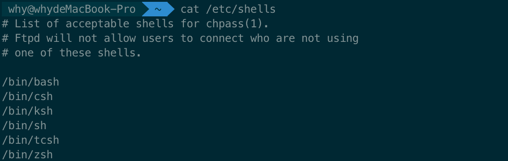
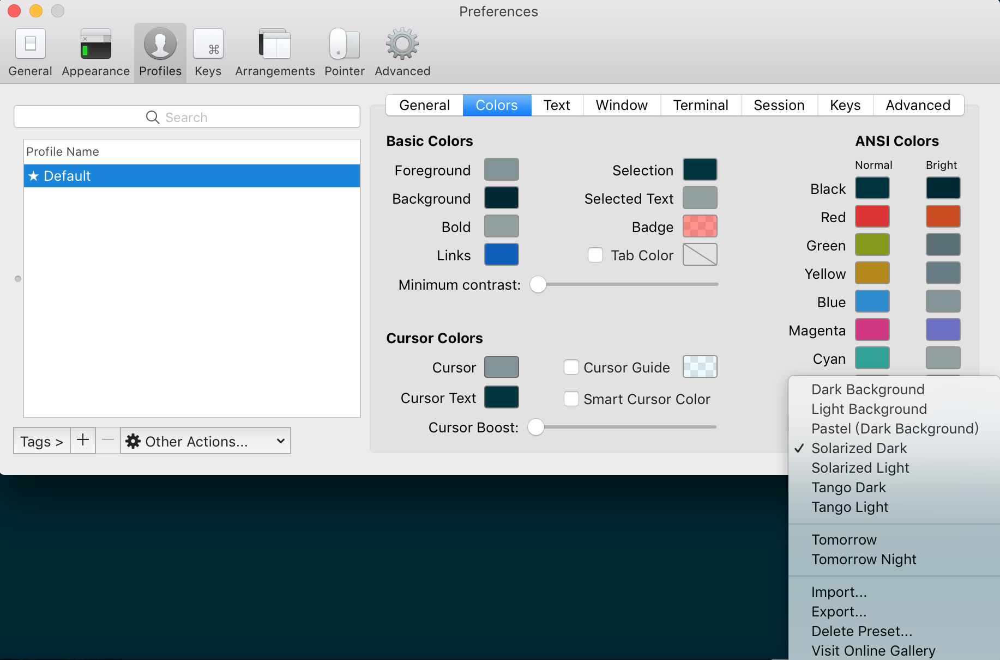
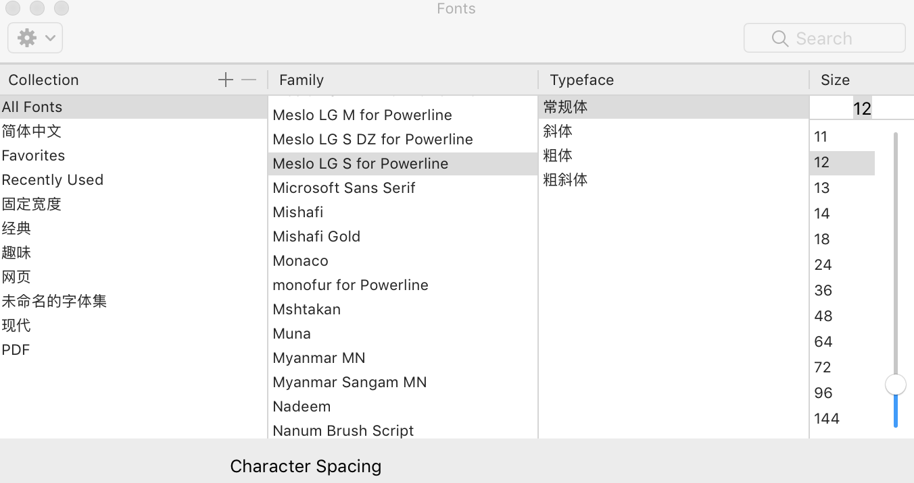

# iTerm2+Oh My Zsh终端配置

## 安装iTerm2
[下载链接地址](https://www.iterm2.com/downloads.html)   

## 安装Oh My Zsh
+ 查看当前系统已安装的shell
```bash
cat /etc/shells
```

+ 安装Oh My Zsh
```bash
sh -c "$(curl -fsSL https://raw.github.com/robbyrussell/oh-my-zsh/master/tools/install.sh)"
```
+ 查看当前正在使用的shell
```bash
echo $SHELL   
Mac电脑默认使用的shell为bash
如果没有更换过会看到输出：/bin/bash
```
+ 切换shell
```bash
chsh -s /bin/zsh 将shell切换为zsh，重启终端生效！！！
```

## 配置主题
主题列表  
[所有主题在线预览](https://github.com/ohmyzsh/ohmyzsh/wiki/Themes)

修改主题为agnoster
```
1.打开zsh配置文件 vim ~/.zshrc
2.修改ZSH_THEME="agnoster"
3.agnoster主题设置成功还要做依赖下面两个东西：
```
+ [Solarized Dark配色方案](https://ethanschoonover.com/solarized/)
```
下载完成之后解压
然后找到iTerm2的Preferences——Profiles——colors——Color Presets
导入刚才下载的配色方案
设置配色方案为Solarized Dark
```

+ [特殊字体安装](https://github.com/powerline/fonts)
```
# clone
git clone https://github.com/powerline/fonts.git --depth=1
# install
cd fonts
./install.sh
# clean-up a bit
cd ..
rm -rf fonts
安装完成后在iTerm2的Preferences——Profiles——Text——Font
点击change Font将All Font设置为Meslo LG S for Powerline即可
```


